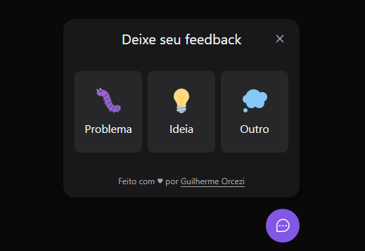
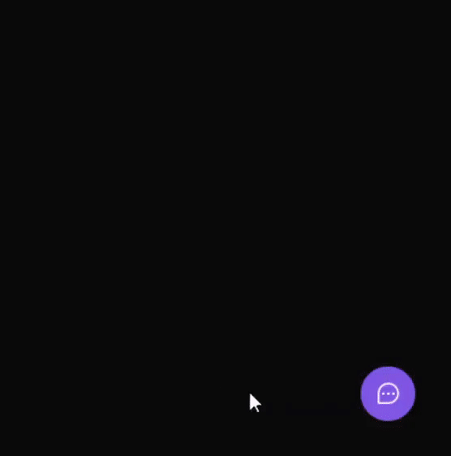

<h3 align="center">
    
    <br>
</h3>
<p align="center"> 🚀 <strong>FeedGet</strong> | Project developed on the 8th edition of Rocketseat's NLW.
 </p>

<p align="center">
   
  <a href="https://github.com/guilhermeorcezi/feedget#readme">
    
  </a>
  <a href="https://github.com/guilhermeorcezi/feedge/graphs/commit-activity">
    
  </a>
  <a href="https://github.com/guilhermeorcezi/feedge/blob/main/LICENSE">
    
  </a>
</p>

# :pushpin: Table of Contents

- [About](#sobre)
- [Technologies](#tecnologias-utilizadas)
- [How to run](#como-usar)
- [How to Contribute](#como-contribuir)

<a id="sobre"></a>
## :bookmark: About

<strong>FeedGet</strong> is a feedback widget that can be integrated into any website to receive feedback on bugs, ideas or other comments.

<a id="#tecnologias-utilizadas"></a>
## :rocket: Technologies

The project was developed using the following technologies

- [TypeScript](https://www.typescriptlang.org/)
- [ReactJS](https://reactjs.org/)
- [Tailwind CSS](https://tailwindcss.com/)
- [Phosphor Icons](https://phosphoricons.com/)
- [Headless Ui](https://headlessui.dev/)
- [NodeJS](https://nodejs.org/en/)
- [Prismic](https://prismic.io/)
- [React Native](https://reactnative.dev/)
- [Expo](https://expo.dev/)

### Web application running
<div style="display: flex; flex-direction: 'row'; align-items: 'center'; justify-content:'center">
       
</div>

<a id="#como-usar"></a>
## :fire: How to run - React web application

To start the NextJS application:
```bash
cd web
yarn install // npm install
yarn dev // npm run dev
```
After the process is over, the `localhost: 3000` page containing the developed project will automatically open in your browser. 

## :fire: How to run - React Native application

To start the NextJS application:
```bash
cd mobile
yarn install // npm install
yarn dev // npm dev
```
After the process is over, the `http://localhost:19002/` page containing the QR Code to open the application on the Expo application at your mobile will open. You can also open the react native application with an emulator.

## :fire: How to run - NODEjs backend application

To start the NextJS application:
```bash
cd server
yarn install // npm install
yarn dev // npm run dev
```
After the process is over, you can acess the server on `http://localhost:3333/`.

<a id="#como-contribuir"></a>
### :recycle: How to contribute
- First, leave a ⭐ if you like it!
- Fork this repository;
- Create a branch with your feature: `git checkout -b my-feature`
- Commit your changes: `git commit -m 'feat: My new feature'`
- Push your branch: `git push origin my-feature`

## :memo: License

This project is under the MIT license. See the [licence page](https://opensource.org/licenses/MIT) for more details.

---

<h4 align="center">
    Made with 💜 by <a href="https://www.linkedin.com/in/guilherme-orcezi" target="_blank">Guilherme Orcezi</a>
</h4>
